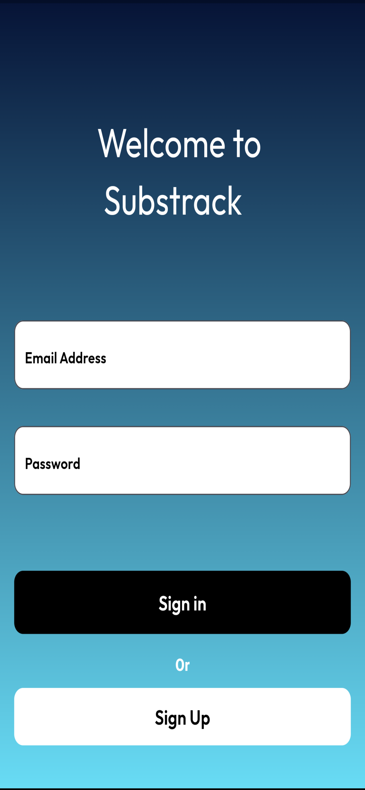
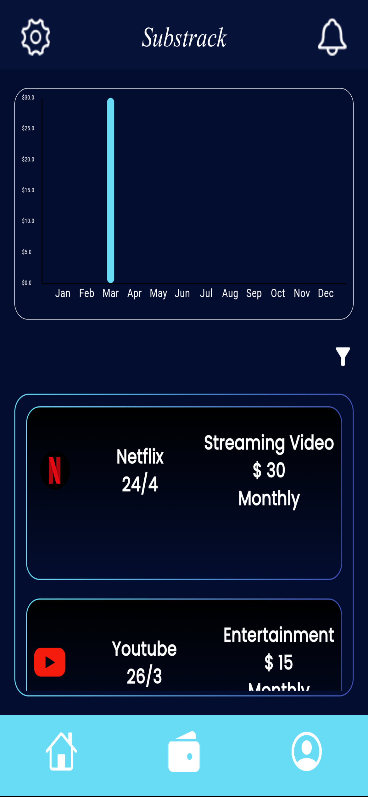
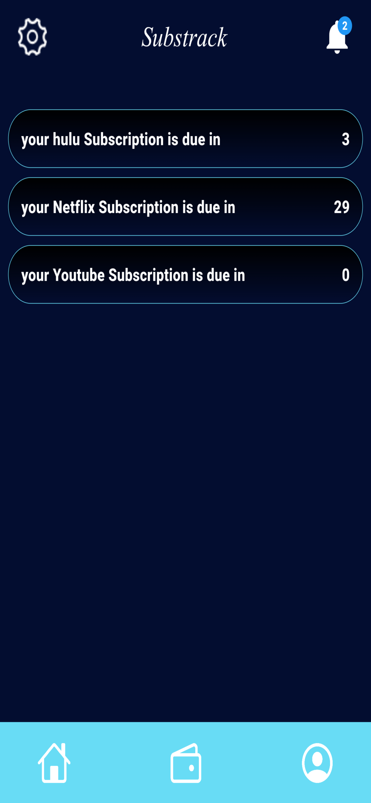

# SubsTrack - Subscription Management and Tracking App 💳

### 🚀 Overview
**SubsTrack** is a robust React Native financial utility designed to help users regain control over their recurring expenses. It consolidates scattered subscription data into a centralized dashboard, offering actionable insights and automated renewal reminders to prevent unwanted billing.

> *Note: This repository is a portfolio showcase. The source code is private.*

---

### 📸 App Interface

<!-- Replace these filenames with your actual uploaded images -->
| Splash Screen | Login | Dashboard | Analytics | Notifications |
|:---:|:---:|:---:|:---:|:---:|
|  |  |  |  |  |

---

### App Demo
[SubsTrack Demo](https://alnemerabdulwahab.github.io/SubsTrack-College/demo.mp4)

---

### 💡 Key Features

#### 1. Centralized Management Dashboard
*   Consolidates active subscriptions, billing dates, and costs into a unified view.
*   Visualizes spending habits with clear breakdowns of Monthly vs. Yearly commitments.

#### 2. Intelligent Reminder System
*   **Custom Notifications:** Configurable push alerts reminding users of upcoming renewals (e.g., 24h before billing).
*   **Multi-channel Support:** Designed to support In-App alerts, Push Notifications, and Email triggers.

#### 3. Financial Analytics & Budgeting
*   **Cost Tracking:** Robust algorithms calculate total projected spend.
*   **Budgeting Tools:** Visual indicators help users stay within their defined monthly spending limits.

---

### 🛠 Tech Stack
*   **Framework:** React Native (JavaScript/TypeScript).
*   **Design:** Pixel-perfect implementation from **Figma** designs.
*   **Logic:** Custom hooks for date calculation and background scheduling.

---

### 📬 Contact
If you are interested in the technical details or the development process, feel free to reach out to me via LinkedIn.
